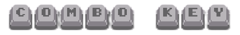
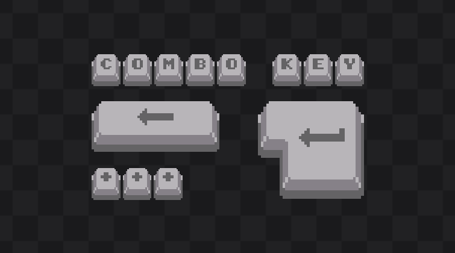
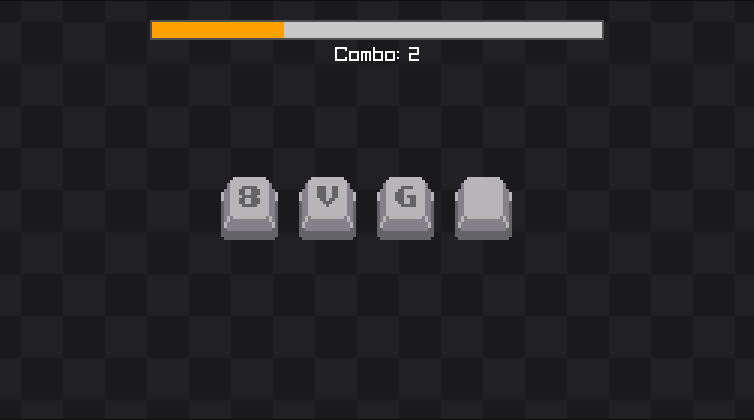

[Acesse a versão em inglês do README](README.md).

<div align="center">
  <a href="https://combokey.audibert.dev">
    
  </a>
</div>

# Combo Key

Um jogo de reflexos desafiador onde você deve pressionar rapidamente as teclas na ordem que aparecem na tela. Cada acerto constrói seu combo, mas **um único erro quebra tudo**. Desenvolvido em C++ com a biblioteca Raylib.

## Sobre o Jogo

**Combo Key** testa sua velocidade e precisão ao máximo! Sequências de teclas aparecem na tela e você tem um tempo limitado para pressioná-las na ordem correta. A cada sequência completada, seu combo aumenta e uma nova sequência mais longa é gerada.

### Como Jogar

1. Uma sequência de teclas aparece na tela
2. Pressione as teclas na ordem correta antes que o tempo acabe
3. Complete a sequência para ganhar +1 combo e enfrentar uma sequência maior
4. Continue até errar ou o tempo acabar

### Sistema de Dificuldades

O jogo possui **3 níveis de dificuldade** que controlam o tempo disponível:

| Dificuldade | Tempo Inicial | Bônus por Acerto |
| ----------- | ------------- | ---------------- |
| **Fácil**   | 4.0 segundos  | +1.0 segundo     |
| **Médio**   | 2.5 segundos  | +1.0 segundo     |
| **Difícil** | 1.0 segundo   | +1.0 segundo     |

> [!NOTE]  
> Ganhar tempo bônus nunca excede o limite da dificuldade. No nível Difícil, mesmo acertando, o tempo máximo permanece 1 segundo.

## Recursos

- **Visual:** Interface intuitiva com animações suaves
- **Áudio:** Sons únicos para cada ação (teclas, combos, falhas) - efeitos sonoros do jogo UNDERTALE
- **Música:** Trilha sonora envolvente
- **Som de Entrada:** Narração personalizada dizendo o nome do jogo, gravada com minha própria voz e editada
- **Teclas Suportadas:** A-Z, números 0-9 e setas direcionais
- **Animações:** Transições fluidas e feedback visual imediato

## Demo

### Menu Principal



### Gameplay



## Controles

### No Menu:

- **ENTER** para iniciar o jogo
- **Plus (+)** para selecionar dificuldade
- **BACKSPACE** para sair

> [!NOTE]
> Clique nas letras COMBO/KEY para alterá-las aleatoriamente (Apenas um detalhe)

### Durante o Jogo:

- **A-Z** - Pressione as letras correspondentes
- **0-9** - Pressione os números correspondentes
- **Setas** - Use as setas direcionais
- **Qualquer tecla** - Para a tecla sem desenho

### Tela de Game Over:

- **ENTER** - Jogar novamente
- **ESC** - Voltar ao menu principal
- **BACKSPACE** - Sair do jogo

## Mecânicas de Jogo

### Sistema de Combo

- **Progressão:** A cada sequência completada, o combo aumenta em +1
- **Sequências Crescentes:** Começe com 1-8 teclas aleatórias, aumente até 8 teclas máximo
- **Reset Fatal:** Qualquer erro reseta o combo para 0 e elimina o jogador

### Sistema de Tempo

- **Tempo Limite:** Baseado na dificuldade selecionada
- **Bônus de Acerto:** +1 segundo por tecla correta (limitado pelo máximo da dificuldade)
- **Game Over:** Tempo zerado ou tecla errada = fim de jogo

### Geração de Sequências

- **Aleatório:** Cada nova rodada gera sequências únicas
- **Variedade:** Letras, números e setas direcionais
- **Teclas Especiais:** Tecla vazia aceita qualquer entrada

## Tecnologias

- **C++** - Linguagem principal
- **Raylib** - Framework para gráficos, áudio e input
- **Emscripten** - Compilação para JavaScript para execução no navegador
- **Assets customizados** - Sprites, sons e texturas próprias

## Jogar

Jogue no navegador através do link: https://combokey.audibert.dev

Ou baixe para seu sistema:

- **Windows:** `combo-key.exe`
- **Outros sistemas:** Compile o código fonte

## Estrutura do Projeto

```
combo-key/
├── src/                  # Código fonte
│   ├── main.cpp          # Loop principal e lógica do jogo
│   ├── game_logic.h/cpp  # Funções de gameplay
│   └── key_button.h/cpp  # Sistema de botões e interface
├── assets/               # Recursos visuais e sonoros
│   ├── sounds/           # Efeitos sonoros e música
│   ├── keys/             # Sprites das teclas (claro/escuro)
│   ├── others/           # Texturas de fundo
│   └── readme/           # Imagens do README
└── raylib/               # Biblioteca Raylib
```

## Compilação

```bash
# Clone o repositório
git clone https://github.com/seu-usuario/combo-key.git
cd combo-key

# Compile com Raylib instalado (Windows)
g++ -o combo-key src/main.cpp src/key_button.cpp src/game_logic.cpp -lraylib -lopengl32 -lgdi32 -lwinmm
```
