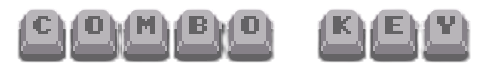

  

# Combo Key

Combo Key is a reflex game where you must quickly press the keys in the order they appear on screen. Each correct input builds your combo, but one mistake breaks it. Made in C++ with the Raylib library.
