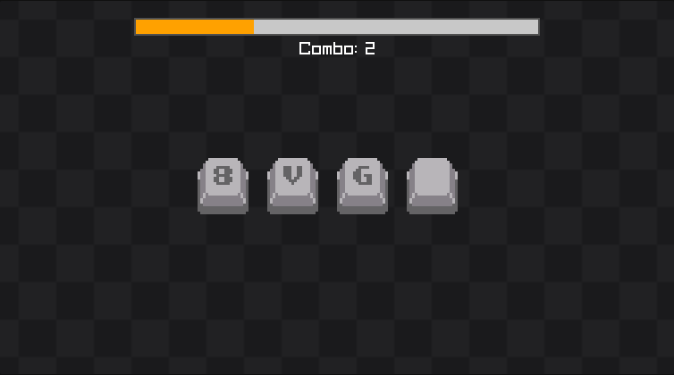

[Access the portuguese version of the README](README-ptbr.md).

<div align="center">
  <a href="https://combokey.audibert.dev">
    
  </a>
</div>

# Combo Key

A challenging reflex game where you must quickly press keys in the order they appear on screen. Each hit builds your combo, but **a single mistake breaks everything**. Developed in C++ with the Raylib library.

## About the Game

**Combo Key** tests your speed and precision to the max! Key sequences appear on screen and you have limited time to press them in the correct order. With each completed sequence, your combo increases and a new longer sequence is generated.

### How to Play

1. A key sequence appears on screen
2. Press the keys in the correct order before time runs out
3. Complete the sequence to gain +1 combo and face a longer sequence
4. Continue until you make a mistake or time runs out

### Difficulty System

The game has **3 difficulty levels** that control the available time:

| Difficulty | Initial Time | Bonus per Hit |
| ---------- | ------------ | ------------- |
| **Easy**   | 4.0 seconds  | +1.0 second   |
| **Medium** | 2.5 seconds  | +1.0 second   |
| **Hard**   | 1.0 second   | +1.0 second   |

> [!NOTE]  
> Gaining bonus time never exceeds the difficulty limit. On Hard level, even when hitting correctly, the maximum time remains 1 second.

## Features

- **Visual:** Intuitive interface with smooth animations
- **Audio:** Unique sounds for each action (keys, combos, failures) - sound effects from UNDERTALE game
- **Music:** Immersive soundtrack
- **Entrance Sound:** Custom narration saying the game name, recorded with my own voice and edited
- **Supported Keys:** A-Z, numbers 0-9 and directional arrows
- **Animations:** Fluid transitions and immediate visual feedback

## Demo

### Main Menu


### Gameplay



## Controls

### In Menu:

- **ENTER** to start the game
- **Plus (+)** to select difficulty
- **BACKSPACE** to exit

> [!NOTE]
> Click on COMBO/KEY letters to change them randomly (Just a detail)

### During Game:

- **A-Z** - Press corresponding letters
- **0-9** - Press corresponding numbers
- **Arrows** - Use directional arrows
- **Any key** - For keys without drawing

### Game Over Screen:

- **ENTER** - Play again
- **ESC** - Return to main menu
- **BACKSPACE** - Exit game

## Game Mechanics

### Combo System

- **Progression:** With each completed sequence, combo increases by +1
- **Growing Sequences:** Start with 1-8 random keys, increase up to 8 keys maximum
- **Fatal Reset:** Any mistake resets combo to 0 and eliminates the player

### Time System

- **Time Limit:** Based on selected difficulty
- **Hit Bonus:** +1 second per correct key (limited by difficulty maximum)
- **Game Over:** Time runs out or wrong key = game over

### Sequence Generation

- **Random:** Each new round generates unique sequences
- **Variety:** Letters, numbers and directional arrows
- **Special Keys:** Empty key accepts any input

## Technologies

- **C++** - Main language
- **Raylib** - Framework for graphics, audio and input
- **Emscripten** - Compilation to JavaScript for web browser execution
- **Custom Assets** - Own sprites, sounds and textures

## Play

Play in browser through the link: https://combokey.audibert.dev

Or download for your system:

- **Windows:** `combo-key.exe`
- **Other systems:** Compile source code

## Project Structure

```
combo-key/
├── src/                  # Source code
│   ├── main.cpp          # Main loop and game logic
│   ├── game_logic.h/cpp  # Gameplay functions
│   └── key_button.h/cpp  # Button system and interface
├── assets/               # Visual and audio resources
│   ├── sounds/           # Sound effects and music
│   ├── keys/             # Key sprites (light/dark)
│   ├── others/           # Background textures
│   └── readme/           # README images
└── raylib/               # Raylib library
```

## Compilation

```bash
# Clone the repository
git clone https://github.com/your-username/combo-key.git
cd combo-key

# Compile with Raylib installed (Windows)
g++ -o combo-key src/main.cpp src/key_button.cpp src/game_logic.cpp -lraylib -lopengl32 -lgdi32 -lwinmm
```
